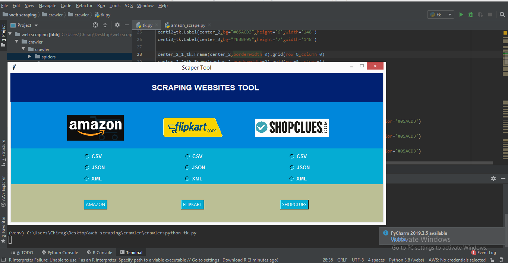

# WEB-SCRAPING
This project is based on python. It is a scraping tool which is used to extract data from websites and make it usable for further process. In this project i use scapy library and request module. Tkinter is used to give GUI to our tool.

How to run ? 

To run this tool first create virtual environment.
requirnments : 
Tkinter
Scarpy

to run this tool : 
python tk.py

</img>

<b>NOTE</b> : If you want to scrap other url simply change url in files which are in spider directory. This tool limited to amazon ,flipcart and shopclue.
